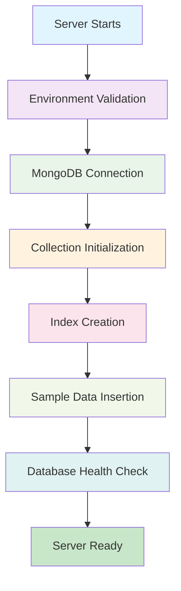

# Backend Startup Verification

## ✅ **Enhanced Backend Startup Process**

The backend system now has a comprehensive startup verification process that ensures all necessary collections and data are properly initialized.

### 🔄 **Startup Flow**



### 📊 **What Happens During Startup**

#### **1. Environment Validation**
- ✅ Checks for required environment variables (`MONGODB_URI`, `JWT_SECRET`)
- ✅ Fails startup if any required variables are missing

#### **2. MongoDB Connection**
- ✅ Connects to MongoDB with proper configuration
- ✅ Pings database to confirm connection
- ✅ Fails startup if connection fails

#### **3. Collection Initialization**
- ✅ Checks for required collections: `users`, `contracts`, `annotations`
- ✅ Creates missing collections using Mongoose models
- ✅ Ensures proper schema validation
- ✅ Updates indexes for existing collections

#### **4. Index Creation**
- ✅ Creates performance indexes for all collections
- ✅ Ensures unique constraints are enforced
- ✅ Updates indexes if collections already exist

#### **5. Sample Data Insertion**
- ✅ Inserts sample data if collections are empty
- ✅ Uses Mongoose models for proper validation
- ✅ Provides fallback data for testing

#### **6. Database Health Check**
- ✅ Verifies all required collections exist
- ✅ Checks index configuration
- ✅ Tests basic database operations
- ✅ Provides database statistics

### 🛠️ **Enhanced Features**

#### **1. Proper Schema Validation**
```javascript
// Before: Raw MongoDB operations
await db.collection('users').insertOne({...});

// After: Mongoose model validation
const user = new User({...});
await user.save();
```

#### **2. Comprehensive Error Handling**
```javascript
// Fails startup if any step fails
try {
  await initializeCollections();
  await verifyDatabaseHealth();
} catch (error) {
  console.error('❌ Database initialization failed:', error);
  process.exit(1);
}
```

#### **3. Database Health Verification**
```javascript
// Verifies collections, indexes, and operations
const verifyDatabaseHealth = async () => {
  // Check collections exist
  // Verify indexes
  // Test basic operations
  // Provide statistics
};
```

### 🚀 **Available Commands**

| Command | Purpose | Description |
|---------|---------|-------------|
| `npm start` | Start server | Full startup with verification |
| `npm run verify-startup` | Test startup | Verify startup process |
| `npm run init-db` | Initialize DB | Manual database initialization |
| `npm run check-db` | Check DB | Check database health |

### 📋 **Startup Output Example**

```
🔌 Connecting to MongoDB...
✅ Successfully connected to MongoDB!
🏓 Pinged your deployment. You successfully connected to MongoDB!
📊 Initializing database collections...
📝 Creating collection: users
✅ Created collection: users with schema validation
📝 Creating collection: contracts
✅ Created collection: contracts with schema validation
📝 Creating collection: annotations
✅ Created collection: annotations with schema validation
📝 Checking for sample data...
📝 Inserting sample user data...
✅ Sample user data inserted
📝 Inserting sample contract data...
✅ Sample contract data inserted
📝 Inserting sample annotation data...
✅ Sample annotation data inserted
✅ Sample data insertion completed!
🔍 Verifying database health...
📊 Collection 'users' has 4 indexes
📊 Collection 'contracts' has 4 indexes
📊 Collection 'annotations' has 3 indexes
📈 Database statistics:
  👤 Users: 1
  📄 Contracts: 1
  📝 Annotations: 1
✅ Database health verification completed!
🎉 Database initialization completed successfully!
```

### 🔧 **Troubleshooting**

#### **Common Issues**

1. **Missing Environment Variables**
   ```
   ❌ Missing required environment variables: MONGODB_URI
   💥 Server startup failed due to database issues
   ```
   **Solution**: Set `MONGODB_URI` in `.env` file

2. **Database Connection Failed**
   ```
   ❌ MongoDB connection error: connect ECONNREFUSED
   💥 Server startup failed due to database issues
   ```
   **Solution**: Check MongoDB is running and accessible

3. **Collection Creation Failed**
   ```
   ❌ Error initializing collections: E11000 duplicate key error
   💥 Server startup failed due to database issues
   ```
   **Solution**: Check for conflicting data or indexes

#### **Verification Commands**

```bash
# Test startup process
npm run verify-startup

# Check database health
npm run check-db

# Initialize database manually
npm run init-db
```

### 🎯 **Benefits**

1. **✅ Guaranteed Initialization**: Collections are always created if missing
2. **✅ Schema Validation**: All data uses proper Mongoose validation
3. **✅ Performance Optimized**: Proper indexes are created automatically
4. **✅ Error Prevention**: Startup fails if database issues are detected
5. **✅ Development Ready**: Sample data is provided for testing
6. **✅ Production Ready**: Comprehensive health checks ensure reliability

### 📈 **Monitoring**

The startup process provides detailed logging for monitoring:
- Collection creation status
- Index configuration
- Sample data insertion
- Database statistics
- Health verification results

This ensures the backend system is always properly initialized and ready for use! 🎉
